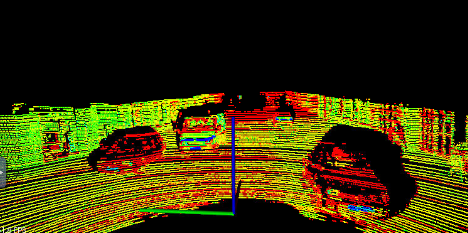
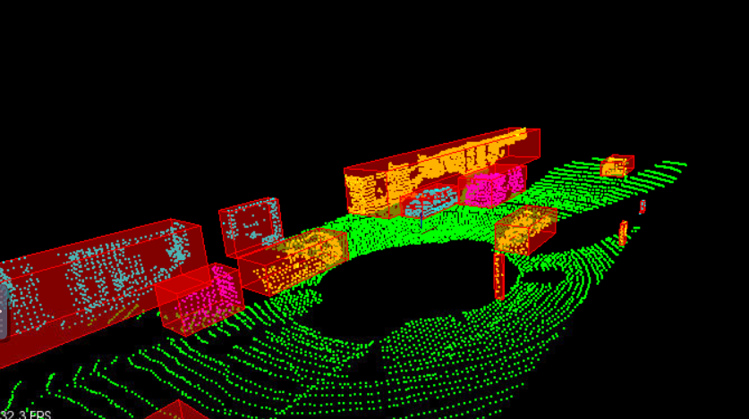

# Sensor Fusion Self-Driving Car Course

**Lidar** sensing gives us high resolution data by sending out thousands of laser signals. 
These lasers bounce off objects, returning to the sensor where we can then determine how far away objects are by timing how long it takes for the sig】

1. Lidar point cloud filtering.
2. Lidar point cloud segmentation using RANSAC.
3. Lidar point could clustering using KD-tree & Nearest Neighbor.

Raw point cloud data: 

Processed point cloud data: 

## Installation

### Linux Ubuntu 16

Install PCL, C++

The link here is very helpful, 
https://larrylisky.com/2014/03/03/installing-pcl-on-ubuntu/

A few updates to the instructions above were needed.

* libvtk needed to be updated to libvtk6-dev instead of (libvtk5-dev). The linker was having trouble locating libvtk5-dev while building, but this might not be a problem for everyone.

* BUILD_visualization needed to be manually turned on, this link shows you how to do that,
http://www.pointclouds.org/documentation/tutorials/building_pcl.php

