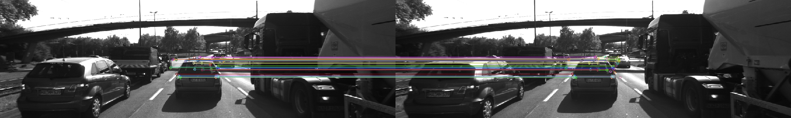
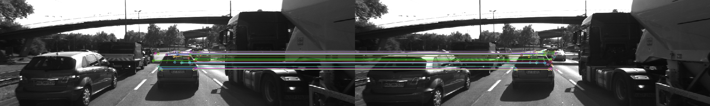
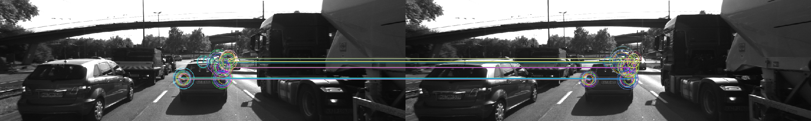
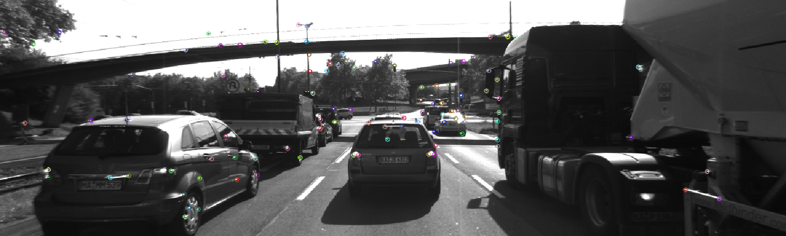
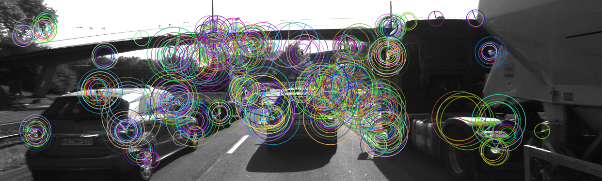
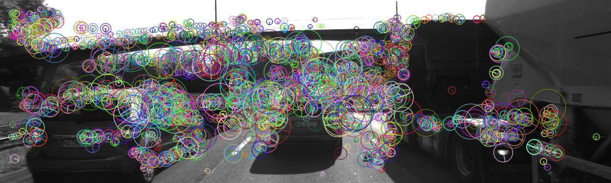

# Camera 2D Feature Matching Writeup

This project focus on the feature matching techniques on image data, which consists of feature/keypiont detector, keypoint descriptor and descriptor matching.

To fulfill the requirements of this project, we could discuss from three aspects:
1. Keypoint detection: `SHITOMASI`, `HARRIS`, `FAST`, `BRISK`, `AKAZE`, `SIFT`.
2. Keypoint description: `BRISK`, `ORB`, `FREAK`, `AKAZE`, `SIFT`.
3. Descriptor matching: `Brute Force`, `FLANN`.

### MP.1 Data Buffer Optimization
Firstly make sure the 1. image buffer size, 2. FIFO machanism. Therefore, in the loop using `vector::erase()` to remove the beginning element in the vector containter, and `vector::push_back` to add a new image into the buffer.

### MP.2 Keypoint Detection
Implemented `HARRIS`, `FAST`, `BRISK`, `ORB`, `AKAZE`, and `SIFT` in _matching2D.cpp_ using opencv API. `detect()` method is called for keypoint detection.

### MP.3 Keypoint Removal
Generally there are two demands of keypoint removal: 1. using bounding box to only focus on the pixle region of the preceding vehicle; 2. only retain the keypoints with better qualities so that release the burden of computing.
Option 1 is implemented by using `std::vector::remove_if` with a predefined `cv::Rect` rectangle. Option 2 is ready by using `vector::erase()` on a sorted keypoints container.

### MP.4 Keypoint Descriptors
Implemented descriptors `BRIEF`, `ORB`, `FREAK`, `AKAZE` and `SIFT` in _matching2D.cpp_ using opencv API. `extract()` method is called for keypoint description.

### MP.5 Descriptor Matching
There are two matching options: 1. Brute_Force (readily-available), 2. FLANN. (value type change required because the poential opencv bug). FLANN is implemenetd using opencv API `cv::DescriptorMatcher::create()`.  

**`FAST` + `BRIEF`**：

**`FAST` + `ORB`**

**`ORB`  + `BRIEF`**

### MP.6 Descriptor Distance Ratio
This part is to implement KNN matching for descriptor distance ratio test in _matching2D.cpp_, which keeps the best 2 matches per keypoint.

### MP.7 Performance Evaluation 1

_Table_ 1: The number of keypoints from different detector.

| Detector  |`SHITOMASI`| `HARRIS`  |   `ORB`   |    `FAST`   |    `SIFT`   |   `BRISK`   |   `AKAZE`   |
|:---------:|:---------:|:---------:|:---------:|:-----------:|:-----------:|:-----------:|:-----------:|
|  Frame 1  |    125    |     15    |    92     |     419     |     138     |     264     |     166     |
|  Frame 2  |    118    |     13    |    102    |     427     |     132     |     282     |     157     |
|  Frame 3  |    123    |     16    |    106    |     404     |     124     |     282     |     161     |
|  Frame 4  |    120    |     14    |    113    |     423     |     137     |     277     |     155     |
|  Frame 5  |    120    |     21    |    109    |     386     |     134     |     297     |     163     |
|  Frame 6  |    113    |     32    |    125    |     414     |     140     |     279     |     164     |
|  Frame 7  |    114    |     14    |    130    |     418     |     137     |     289     |     173     |
|  Frame 8  |    123    |     27    |    129    |     406     |     148     |     272     |     175     |
|  Frame 9  |    111    |     21    |    127    |     396     |     159     |     266     |     177     |
|  Frame 10 |    112    |     23    |    128    |     401     |     137     |     254     |     179     |

And here are the visualized results of keypoint detector:

**SHI-TOMASI**: Shi-Tomasi keypoint cannot provided rotation and scale infomation. The keypoint detection distribution is across the image, and the more rapid the pixels changes area the more keypoints detected such as the vehicle edge, bridge edge and tree. But there are some of them looked noisey.

**HARRIS**: Harris's keypoint cannot provide rotation and scale information, and its layout seems more sparse than Shi-Tomasi, and keypoints are apart from each other becasue of the non-maximum suppression.

**FAST**: FAST detector cannot provide rotation and scale information as well. The layout of keypoints is similiar to that of Shi-Tomasi: keypoints detection are dense where the pixels rapid changes but more dense.

**SIFT**: SIFT detector provided rotation and scale infomation. Tiny features are detected in lower layer in image pyramids such as tree's or road's texture, and larger features are catch in upper layers in pyramids because the keypoint's size become larger.

**ORB**: SIFT detector provided rotation and scale infomation. The size of the keypiont is relatively larger, also the distribution seems more centered. Interesting finding that it doesn't detect any keypoint around the vehicle's shadow.

**BRISK**: BRISK detector provided rotation and scale infomation. The keypoints are detected where the pixel rapidly changes.

**AKAZE**: AKAZE detector provided rotation and scale infomation. The size of all keypoints are similiar. 

### MP.8 Performance Evaluation 2
_Table_ 2-7: The number of descriptor matching from combination of detector & descriptor. The mathcing is Brute_Force with the K-Nearest-Neighborhood (descriptor distance ratio = 0.8). 

|**BRISK**  |`SHITOMASI`|`HARRIS`| `ORB` | `FAST` | `SIFT` | `BRISK` | `AKAZE`|
|:---------:|:---------:|:------:|:-----:|:------:|:------:|:-------:|:------:|
| Frame 1-2 |    44     |   10   |  41   |  35    |  18    |   33    |   35   |
| Frame 2-3 |    37     |   8    |  44   |  35    |  22    |   32    |   39   |
| Frame 3-4 |    39     |   7    |  38   |  38    |  19    |   32    |   38   |
| Frame 4-5 |    38     |   10   |  44   |  37    |  21    |   36    |   43   |
| Frame 5-6 |    38     |   16   |  37   |  26    |  18    |   36    |   39   |
| Frame 6-7 |    36     |   12   |  37   |  40    |  27    |   36    |   42   |
| Frame 7-8 |    38     |   13   |  34   |  39    |  15    |   31    |   39   |
| Frame 8-9 |    38     |   18   |  35   |  40    |  18    |   27    |   36   |
| Frame 9-0 |    39     |   17   |  36   |  45    |  27    |   41    |   44   |

|**BRIEF**  |`SHITOMASI`|`HARRIS`| `ORB` | `FAST` | `SIFT` | `BRISK` | `AKAZE`|
|:---------:|:---------:|:------:|:-----:|:------:|:------:|:-------:|:------:|
| Frame 1-2 |    47     |   11   |  30   |  30    |  25    |   36    |   38   |
| Frame 2-3 |    49     |   11   |  18   |  18    |  26    |   32    |   37   |
| Frame 3-4 |    44     |   11   |  22   |  22    |  25    |   35    |   40   |
| Frame 4-5 |    44     |   13   |  29   |  29    |  30    |   36    |   40   |
| Frame 5-6 |    46     |   19   |  28   |  28    |  21    |   34    |   39   |
| Frame 6-7 |    46     |   19   |  36   |  36    |  31    |   32    |   44   |
| Frame 7-8 |    46     |   14   |  34   |  34    |  19    |   39    |   39   |
| Frame 8-9 |    47     |   21   |  28   |  28    |  18    |   31    |   39   |
| Frame 9-0 |    44     |   17   |  36   |  36    |  28    |   37    |   44   |

|  **ORB**  |`SHITOMASI`|`HARRIS`| `ORB` | `FAST` | `SIFT` | `BRISK` | `AKAZE`|
|:---------:|:---------:|:------:|:-----:|:------:|:------:|:-------:|:------:|
| Frame 1-2 |    27     |   21   |  33   |  43    |   -    |   27    |   35   |
| Frame 2-3 |    34     |   11   |  36   |  44    |   -    |   34    |   38   |
| Frame 3-4 |    31     |   10   |  38   |  41    |   -    |   31    |   36   |
| Frame 4-5 |    37     |   14   |  38   |  45    |   -    |   37    |   37   |
| Frame 5-6 |    35     |   20   |  41   |  39    |   -    |   35    |   33   |
| Frame 6-7 |    39     |   15   |  37   |  42    |   -    |   39    |   36   |
| Frame 7-8 |    32     |   13   |  35   |  38    |   -    |   32    |   34   |
| Frame 8-9 |    30     |   19   |  37   |  44    |   -    |   30    |   37   |
| Frame 9-0 |    34     |   18   |  42   |  48    |   -    |   34    |   40   |

| **FREAK** |`SHITOMASI`|`HARRIS`| `ORB` | `FAST` | `SIFT` | `BRISK` | `AKAZE`|
|:---------:|:---------:|:------:|:-----:|:------:|:------:|:-------:|:------:|
| Frame 1-2 |    39     |   11   |  33   |  36    |   21   |   35    |   31   |
| Frame 2-3 |    42     |   10   |  23   |  36    |   23   |   35    |   39   |
| Frame 3-4 |    38     |   9    |  28   |  31    |   21   |   35    |   41   |
| Frame 4-5 |    35     |   11   |  27   |  35    |   23   |   39    |   32   |
| Frame 5-6 |    39     |   15   |  27   |  34    |   14   |   33    |   33   |
| Frame 6-7 |    37     |   18   |  25   |  38    |   24   |   41    |   39   |
| Frame 7-8 |    33     |   11   |  28   |  34    |   17   |   32    |   37   |
| Frame 8-9 |    39     |   18   |  21   |  36    |   15   |   34    |   39   |
| Frame 9-0 |    39     |   15   |  28   |  43    |   31   |   37    |   39   |

| **SIFT**  |`SHITOMASI`|`HARRIS`| `ORB` | `FAST` | `SIFT` | `BRISK` | `AKAZE`|
|:---------:|:---------:|:------:|:-----:|:------:|:------:|:-------:|:------:|
| Frame 1-2 |    46     |   11   |  39   |  44    |   37   |   34    |   35   |
| Frame 2-3 |    47     |   11   |  45   |  44    |   36   |   35    |   39   |
| Frame 3-4 |    45     |   11   |  44   |  40    |   34   |   36    |   38   |
| Frame 4-5 |    42     |   13   |  40   |  42    |   40   |   37    |   43   |
| Frame 5-6 |    45     |   21   |  37   |  42    |   36   |   33    |   39   |
| Frame 6-7 |    43     |   15   |  41   |  41    |   37   |   37    |   42   |
| Frame 7-8 |    45     |   13   |  41   |  39    |   30   |   31    |   39   |
| Frame 8-9 |    48     |   22   |  39   |  40    |   39   |   34    |   36   |
| Frame 9-0 |    44     |   18   |  42   |  38    |   39   |   36    |   44   |

| **AKAZE** |`SHITOMASI`|`HARRIS`| `ORB` | `FAST` | `SIFT` | `BRISK` | `AKAZE`|
|:---------:|:---------:|:------:|:-----:|:------:|:------:|:-------:|:------:|
| Frame 1-2 |     -     |    -   |   -   |   -    |    -   |    -    |   38   |
| Frame 2-3 |     -     |    -   |   -   |   -    |    -   |    -    |   39   |
| Frame 3-4 |     -     |    -   |   -   |   -    |    -   |    -    |   42   |
| Frame 4-5 |     -     |    -   |   -   |   -    |    -   |    -    |   42   |
| Frame 5-6 |     -     |    -   |   -   |   -    |    -   |    -    |   37   |
| Frame 6-7 |     -     |    -   |   -   |   -    |    -   |    -    |   46   |
| Frame 7-8 |     -     |    -   |   -   |   -    |    -   |    -    |   39   |
| Frame 8-9 |     -     |    -   |   -   |   -    |    -   |    -    |   37   |
| Frame 9-0 |     -     |    -   |   -   |   -    |    -   |    -    |   44   |

### MP.9 Performance Evaluation 3
_Table_ 8-9: The timing data for detector and descriptor accordingly. In this table, the time is calucated as the average in 10 images.

Detector average running time (s):

|           |`SHITOMASI`|`HARRIS`| `ORB` | `FAST` | `SIFT` | `BRISK` | `AKAZE`|
|:---------:|:---------:|:------:|:-----:|:------:|:------:|:-------:|:------:|
|  `BRISK`  |  0.021    | 0.775  | 0.014 | 0.002  | 0.237  | 0.375   | 0.193  |
|  `BRIEF`  |  0.018    | 0.770  | 0.015 | 0.002  | 0.237  | 0.375   | 0.205  |
|  `ORB`    |  0.019    | 0.777  | 0.014 | 0.003  |  N/A   | 0.408   | 0.182  |
|  `FREAK`  |  0.199    | 0.812  | 0.014 | 0.003  | 0.240  | 0.402   | 0.189  |
|  `AKAZE`  |   N/A     |  N/A   |  N/A  |  N/A   |  N/A   |  N/A    | 0.182  |
|  `SIFT`   |  0.025    | 0.771  | 0.010 | 0.003  | 0.211  | 0.381   | 0.177  |

Descriptor average running time (s):

|           |`SHITOMASI`|`HARRIS`| `ORB` | `FAST` | `SIFT` | `BRISK` | `AKAZE`|
|:---------:|:---------:|:------:|:-----:|:------:|:------:|:-------:|:------:|
|  `BRISK`  |   0.383   | 0.330  | 0.330 | 0.334  | 0.308  |  0.330  | 0.387  |
|  `BRIEF`  |   0.001   | 0.001  | 0.001 | 0.001  | 0.001  |  0.001  | 0.001  |
|  `ORB`    |   0.001   | 0.001  | 0.008 | 0.002  |  N/A   |  0.007  | 0.004  |
|  `FREAK`  |   0.058   | 0.041  | 0.006 | 0.060  | 0.040  |  0.042  | 0.049  |
|  `AKAZE`  |   N/A     |  N/A   |  N/A  |  N/A   |  N/A   |  N/A    | 0.168  |
|  `SIFT`   |   0.037   | 0.027  | 0.094 | 0.045  | 0.119  |  0.048  | 0.037  |

## Conclusion
From the timing results in MP.9: (">" means "faster than")
1. for detector: `FAST` > `ORB` > others.
2. for descriptor: `BRIEF` > `ORB` > others.

Also compared the results from MP.7 and MP.8, I'd recommend the best three picks are:
1. `FAST` + `BRIEF`.
2. `FAST` + `ORB`.
3. `ORB`  + `BRIEF`

