# Camera 2D Object Tracking: Camera & Lidar Fusion


### FP.1 Match 3D Objects
Implemented the method "matchBoundingBoxes". The alogorithm is to related bounding boxes in previous and current frame, by using the knowledge from feature matching.
The first step is to generate a 2D container, the col and row are the bounding box index from previous and current frame respectively. Then loop through all matched features (in `cv::DMatch`), check its `queryIdx` & `trainIdx` to get the corresponding bounding box's index which the keypoint belongs to, and increase the 2D container accordingly. After construct the 2D container, complete the `map<int, int>` but choosing the best matching which has the highest number of keypoint correspondences from each row.


### FP.2  Compute Lidar-based TTC
To compute the time-to-collision based on Lidar, this part would follow the Constant Velocity Model and calculate the TTC from:
```cpp
TTC = (d1 * dT) / (d0 - d1);
```
Apart from preparing the Lidar Point clouds, it is important to make it robust against outliers which could results in faulty estimation. To tackle the outliers problem, there are mant approaches on hands, such as PCA, DBSCAN... but in this project a statistic method has been leveraged. The algorithm is simple: 
1. calucate `mean` & standard derivative `std`.
2. choose a threshold as `mean - n * std` for outlier removal. (n = 1, 2, or 3, in this project n = 2)
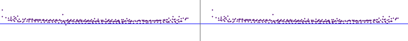
After outlier removal, the closest lidar point to the ego vehicle is picked for TTC calculation. 


### FP.3 Associate Keypoint Correspondences with Bounding Boxes
Find all keypoint matches that belong to each 3D object, by checking whether the corresponding keypoints are within the region of interest in the camera image. One problem can be addressed as outliers removal. From the forum, this can be solved by leveraging mean of all the Euclidean distances between keypoint matches and then remove those are too far from the mean. 

In this project, a RANSAC based appraoch has been developed. The idea is to by calculateing the prespective relationship (Homography matrix)`cv::findHomography()` between keypoints in the bounding box from different frame, it can use RANSAC (`cv::RANSAC`) for inlier keypoints estimation and inlier matches as well.

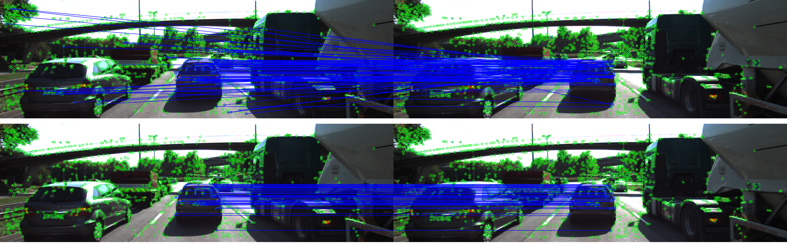

Once all the keypint matches within the bounding boxes, then compute TTC estimate.


### FP.4 Compute Camera-based TTC
Compute the time-to-collision in second for all matched 3D objects using only keypoint correspondences from the matched bounding boxes between current and previous frame.

To compute the time-to-collision based on Lidar, this part would follow the Constant Velocity Model and calculate the TTC from:
```cpp
TTC = -dT / (1 - meanDistRatio);  

TTC = -dT / (1 - medianDistRatio);   // with outlier
```
This part in the project is using the previous solution for TTC estimate problem, which is based on median distance ration. 

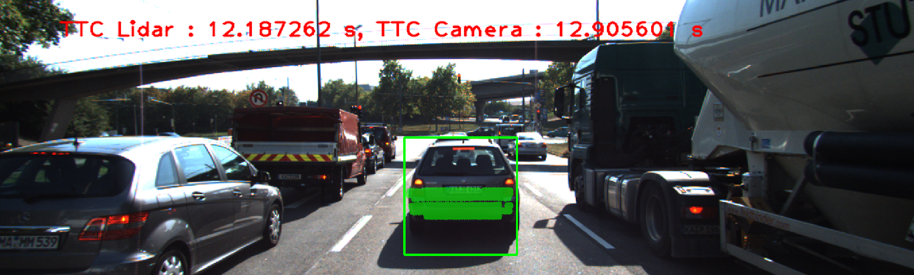

The 2D feature matching is completed in previous project, after integrating that code and the Lidar-Camera fusion TCC estimate system could be ready for performance validation. 


### FP.5 Performance Evaluation 1
Here are examples where the TTC estimate of the Lidar sensor does not seem plausible.

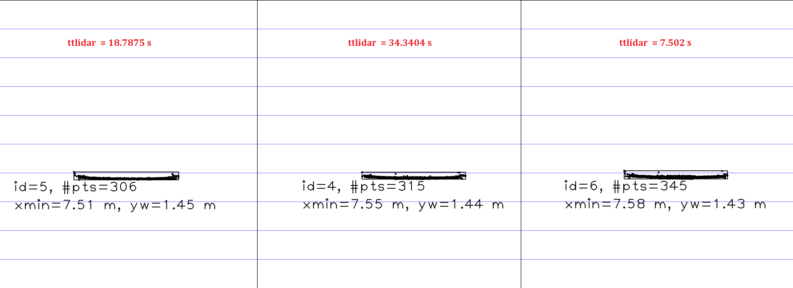

To analyze these plausible cases,the table below has been generated by TTC, Minimum x-distance and decremental in Minimum x-distance from each frame.
 
| Frame | LiDAR ttc (s) | min_x (m)  | decremental (m) |
|:-----:|:-------------:|:----------:|:---------------:|
|   0   |      n/a      | 7.974      |     n/a         |
|   1   |    12.9722    | 7.913      |     0.061       |
|   2   |    12.2640    | 7.849      |     0.064       |
|   3   |    13.9161    | 7.793      |     0.056       |
|   4   |    14.8865    | 7.741      |     0.052       |
|   5   |    12.1873    | 7.678      |     0.063       |
|   6   |     7.5020    | 7.577      |     0.101       |
|   7   |    34.3404    | 7.555      |     0.022       |
|   8   |    18.7875    | 7.515      |     0.040       |
|   9   |    15.8894    | 7.468      |     0.047       |
|  10   |    13.7297    | 7.414      |     0.054       |    
|  11   |    10.4914    | 7.344      |     0.070       |
|  12   |    10.1000    | 7.272      |     0.072       |
|  13   |     9.2231    | 7.194      |     0.078       |
|  14   |    10.9678    | 7.129      |     0.065       |
|  15   |     8.0942    | 7.042      |     0.087       |
|  16   |     8.1391    | 6.963      |     0.215       |
|  17   |    10.2926    | 6.896      |     0.079       |
|  18   |     8.3098    | 6.814      |     0.082       |

Look at the obviously inaccurate cases, such as frame 6-8: the distance decremental are varying dramatically. Becasue the TTC lidar is calculating based on Constant Velocity Model:
```
d(t + t') - d(t) = v0 * t'
```
Firstly looking at the decrements are relatively stable during a constant time interval, such as frame 11 to 13, the TTC was decreasing near linearly because the distance to preceding vehicle is reduced near linearly. So it is in the CVM framework.  
But in practice the CVM assumption is too ideal to get remained. Thus, when the decrements in distance became smaller (preceding vehicle is decelerating), based on the CVM formular the TTC is calculated even much larger (such as in frame 7, 16), meanwhile, the preceding vehicle is accelerating so that the decrements getting larger but the TTC is calculated even smaller. Obviously it does not make sense in real world. 


### FP.6 Performance Evaluation 2
Run several detector / descriptor combinations and look at the differences in TTC estimation. To visualize the TTC_camera from a wide variety of combination of detectors and descriptors, the TTC data from lidar and camera are saved into csv file `data_ttc.csv`. For individual detector, the ttc_camera data with each descriptors are shown along the frame index.

Note that: 1. BF matching and NN selection get employed for tests; 2. when there is not enough feature matching pairs or exceptions, the TTC was set to 0 for sake of process conveniency.

**_SHITOMASI_detector_**：

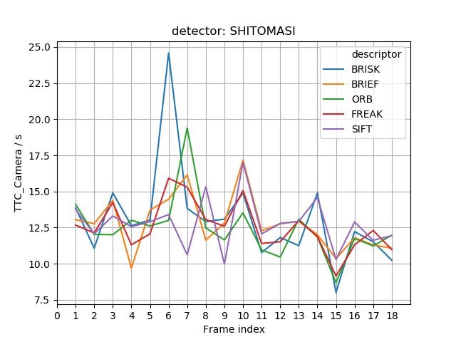

**_HARRIS_detector_**：

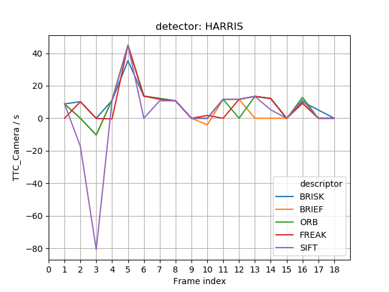

**_ORB_detector_**：

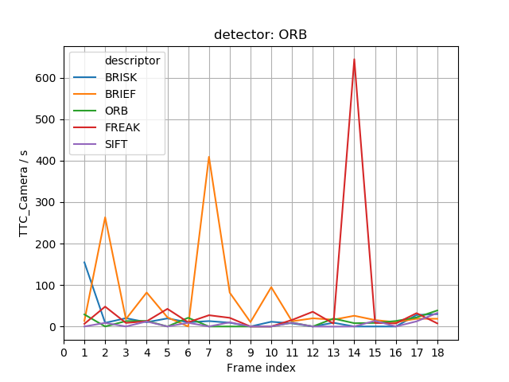

**_SIFT_detector_**：

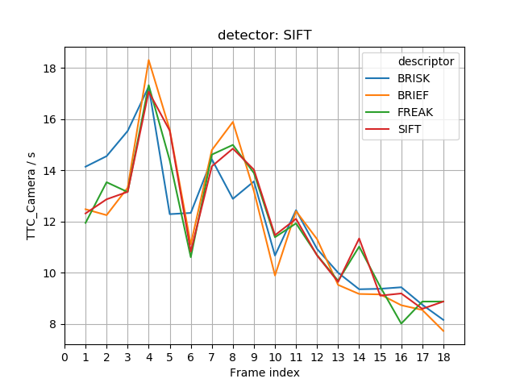

**_FAST_detector_**：

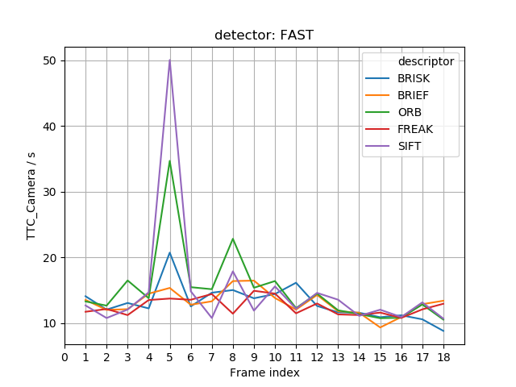

**_BRISK_detector_**：

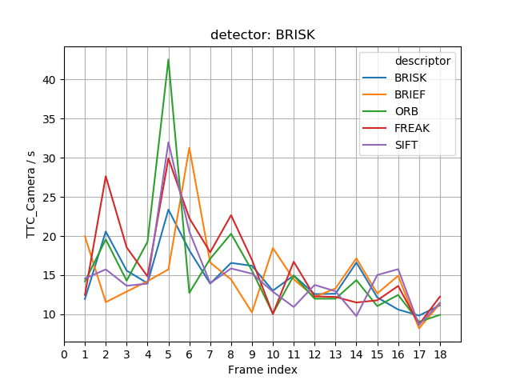

**_AKAZE_detector_**：

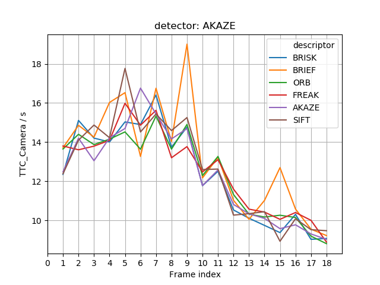

From above plots, `SIFT` & `AKAZE` detector seems to be better candidate in terms of agreement of TTC measuring. In order to dive deeper into the analysis, let's review some cases of failure as below: from observation the failure could occur if:

(1) mismatches of the feature; 

(2) noise matches beyond the object's boundary.


**Conclusion I**:

(a) camera-based TCC estimation did depend on the combination of detector and descriptor.

(b) camera-based TCC estimation could be affetced by the quality of feature matching.


To evaluate the performance of the camera-based and lidar-based TTC estimation, this part will plot the lidar and camera date generated by specific pair of detector and descriptor in following frames. Also to measure the agreement of two TTC measurement, Blant_Altman plot has been introduced for analysis.

Here are candidates plot from `BRIEF` descriptor series, also the top picks from previous projects.

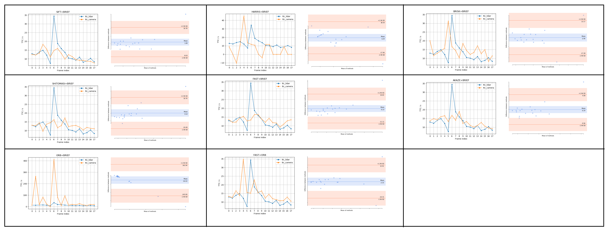

Even though the Lidar-based TTC is an estimation not perfect, and there are outliers in the Lidar-based TTC. By ignoring the outliers we could evaluate the correlation between two measures. From the original data trend, the `SIFT`+`BRIEF`, `BRISK`+`BRIEF`, `FAST`+`BRIEF`, `SHITOMASI`+`BRIEF`, `AKAZE`+`BRIEF`, `FAST`+`ORB` could be filtered out for further analysis. But there are outliers in camera-based TTC estimation from `BRISK`+`BRIEF` and `FAST`+`ORB`. 

Then by comparing the agreement from B/A plots, the fewest offsets are from `FAST`+`BRIEF`, but in frame 16 and 17, the TTC estimation are trending in different ways. `SIFT`+`BRIEF` and `AKAZE`+`BRIEF` could also be winner out of these plots.
 


**Conclusion II**:

Also compared the results prevous discussion I'd recommend the best three picks are:

- `SIFT` + `BRIEF`
- `FAST` + `BRIEF`
- `AKAZE` + `BRIEF`


