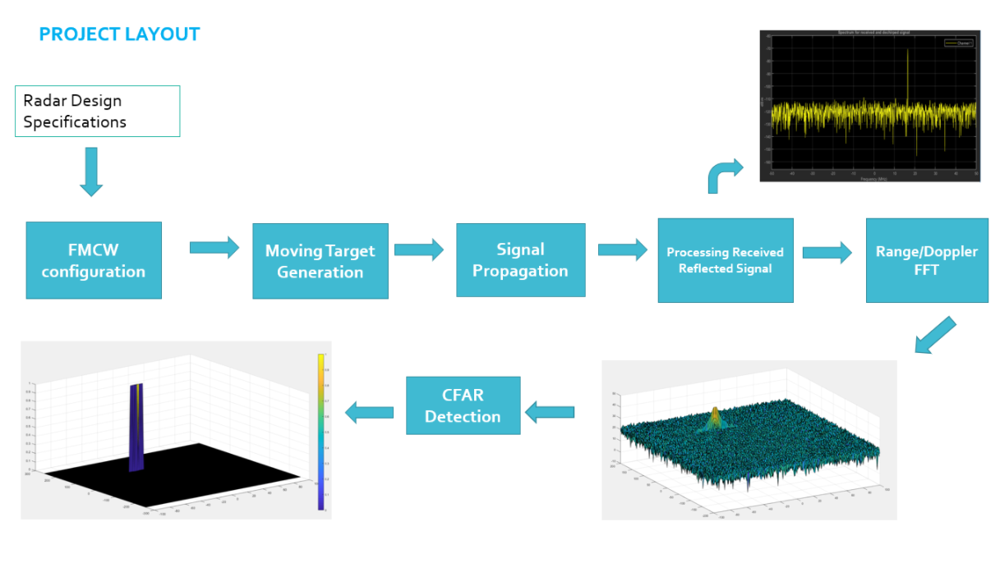
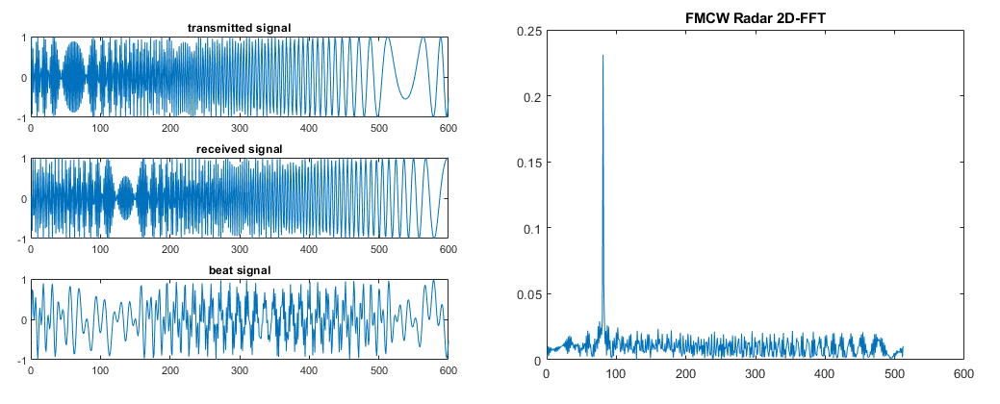
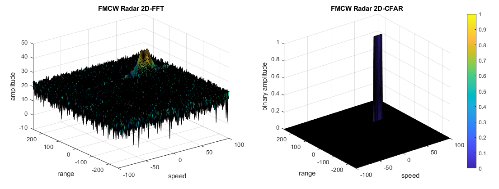

# Radar

- Analyze radar signatures to detect and track objects. 
- Calculate velocity and orientation by correcting for radial velocity distortions, noise, and occlusions. 
- Apply thresholds to identify and eliminate false positives.
- Filter data to track moving objects over time.

## Radar Elements

**FMCW** radar: Frequency-Modulated Continuous Wave radar is a special type of radar sensor which radiates continuous transmission power. FMCW chirp is that the Radar signal's frequency increases/decreases wrt. time. So repeated chrips are repeated and used to compute both distance and velocity. Keypoints: Range, Velocity, Angle Resolution and their math formula.

**Clutter Dynamic Thresholding**: CFAR (Constant False Alarm Rate). The process loops across all the range cells and decides the presence of target based on the noise estimate.The basis of the process is that when noise is present, the cells around the cell of interest will contain a good estimate of the noise, i.e. it assumes that the noise or interference is spatially or temporarily homogeneous. This project focus on CA-CFAR (Cell Averaging).

## Project: Radar Target Generation And Detection

1. Configure the FMCW waveform based on the system requirements.
2. Define the range and velocity of target and simulate its displacement.
3. For the same simulation loop process the transmit and receive signal to determine the beat signal

4. Perform Range FFT on the received signal to determine the Range
5. Towards the end, perform the CFAR processing on the output of 2nd FFT to display the target.

## Dependencies for Running Locally
* cmake >= 3.7
  * All OSes: [click here for installation instructions](https://cmake.org/install/)
* make >= 4.1 (Linux, Mac), 3.81 (Windows)
  * Linux: make is installed by default on most Linux distros
  * Mac: [install Xcode command line tools to get make](https://developer.apple.com/xcode/features/)
  * Windows: [Click here for installation instructions](http://gnuwin32.sourceforge.net/packages/make.htm)
* gcc/g++ >= 5.4
  * Linux: gcc / g++ is installed by default on most Linux distros
  * Mac: same deal as make - [install Xcode command line tools](https://developer.apple.com/xcode/features/)
  * Windows: recommend using [MinGW](http://www.mingw.org/)
