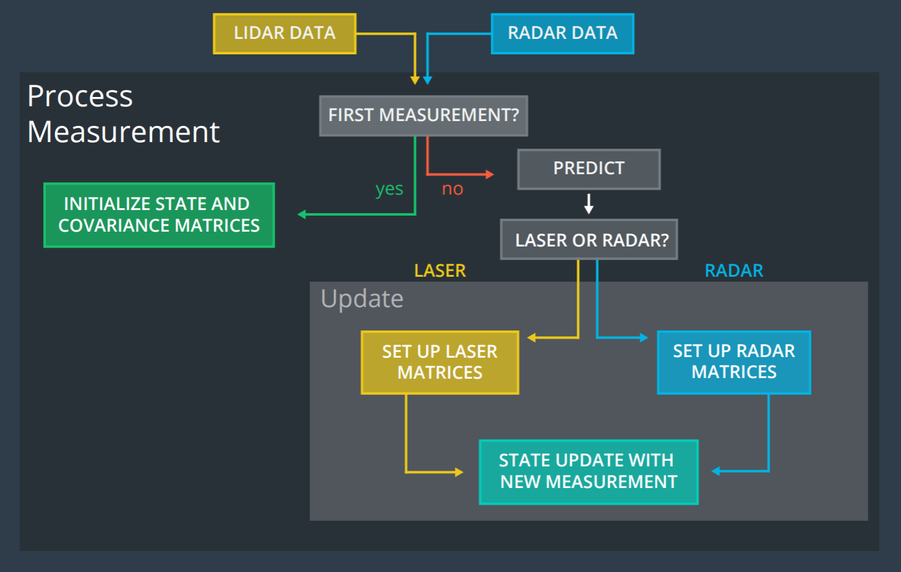

# Fusion: Kalman Filters

- Fuse data from multiple sources using Kalman filters. 
- Merge data together using the prediction-update cycle of Kalman filters, which accurately track object moving along straight lines. 
- Build extended and unscented Kalman filters for tracking nonlinear movement.

## Sensors
Radar: Doppler effect is important for SF, it gives the velocity  an independent/direct measure parameter, and it makes the fusion algorithm converge much faster. Radar can aslo be used for Localization by generating radar map of the environment

## Tracking: 
- Kalman Filter: continuous uni-model
- Particle Filter: continuous multi-model
- Monte Carlo Localization: discrete multi-model

## Kalman Filter:
 Kalman Filter represents distributions by Gaussian and iterates on two main cycles:
- Measurement Update: 1. product, 2. Bayes rule.
- Motion Update: 1. convolution. 2. total probability.
 
 The Kalman Filter covered in this part:
 1. Classical Kalman Filter: usually this Kalman filter is only capable for linear motion model such as constant velocity;
 2. Extended Kalman Filter: measurement function is non-linear, then using Taylor Series Expansion to make linear approximation to get Jacobian matrix (first order - linear) to linearize non-linear functions.
3. Unscented Kalman Filter: the motion model is non-linear, then taking representative points (Sigma Points) from a Guassian distribution, and those points will be plugged into the non-linear equations, to predict Gaussian distributions.

## Project: Unscented Kalman Filter Highway Project
Code an Unscented Kalman Filter in C++ to track highly non-linear vehicle motion (CTRV model) using Lidar and Radar measurements. 

## Dependencies for Running Locally
* cmake >= 3.7
  * All OSes: [click here for installation instructions](https://cmake.org/install/)
* make >= 4.1 (Linux, Mac), 3.81 (Windows)
  * Linux: make is installed by default on most Linux distros
  * Mac: [install Xcode command line tools to get make](https://developer.apple.com/xcode/features/)
  * Windows: [Click here for installation instructions](http://gnuwin32.sourceforge.net/packages/make.htm)
* gcc/g++ >= 5.4
  * Linux: gcc / g++ is installed by default on most Linux distros
  * Mac: same deal as make - [install Xcode command line tools](https://developer.apple.com/xcode/features/)
  * Windows: recommend using [MinGW](http://www.mingw.org/)
