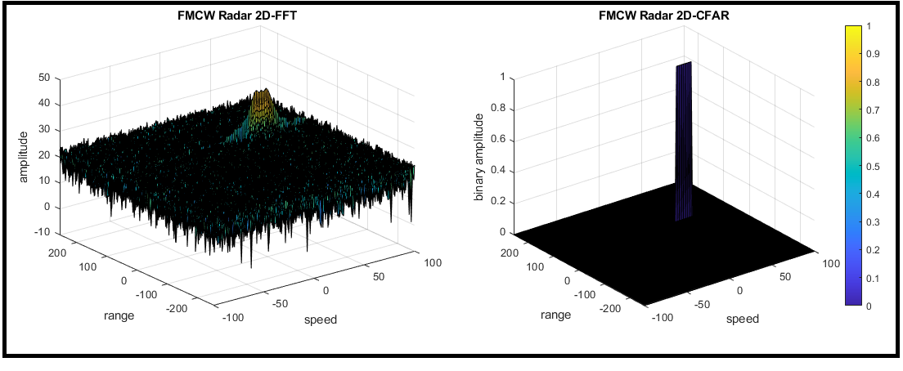

# Sensor Fusion

### Lidar
- Process raw lidar data with filtering, segmentation, and clustering to detect other vehicles on the road. 
- Implementation Ransac with planar model fitting to segment point clouds. 
- Implementation Euclidean clustering with a KD-Tree to cluster and distinguish vehicles and obstacles.

### Camera
- Fuse camera images together with lidar point cloud data. 
- Extract object features from camera images in order to estimate object motion and orientation. 
- Classify objects from camera images in order to apply a motion model. 
- Project the camera image into three dimensions. 
- Fuse the projection into three dimensions to fuse with lidar data to estimate Time-to-Collision.

### Radar
- Analyze radar signatures to detect and track objects. 
- Calculate velocity and orientation by correcting for radial velocity distortions, noise, and occlusions. 
- Apply thresholds to identify and eliminate false positives.
- Filter data to track moving objects over time.

### Kalman Filter
- Fuse data from multiple sources using Kalman filters. 
- Merge data together using the prediction-update cycle of Kalman filters, which accurately track object moving along straight lines. 
- Build extended and unscented Kalman filters for tracking nonlinear movement.
- Unscented Kalman Filter to estimate the state of multiple cars on a highway using noisy lidar and radar measurements. 

